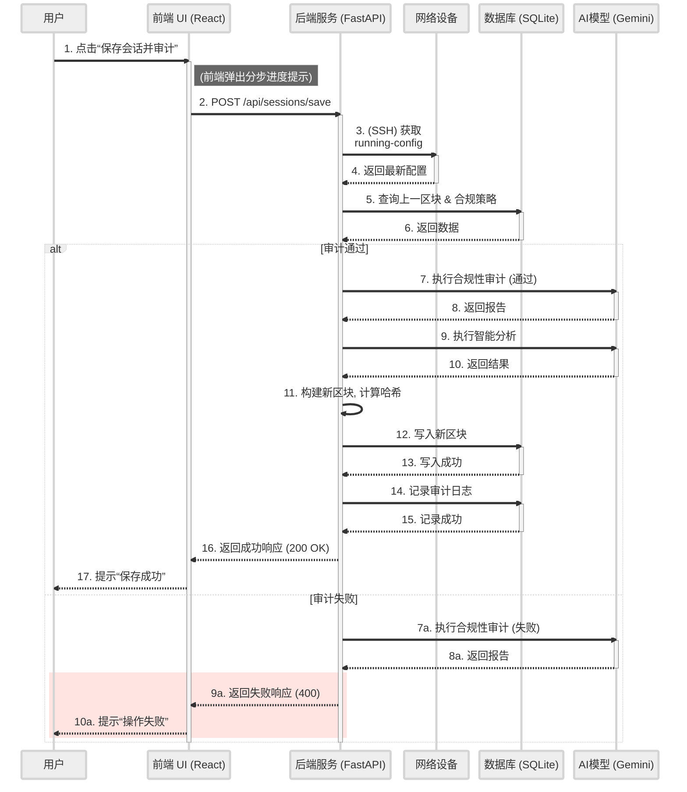

[图表建议 - 类型: 生成图]
[图表标题: 图3-3 “保存会话并审计”操作序列图]
[图表描述: 绘制一张UML序列图。参与者（Lifeline）包括：用户（Actor）、前端UI、后端API、网络设备、Gemini AI、数据库。序列从用户点击“保存并审计”按钮开始，详细展示消息的传递顺序：1. 前端向后端发送API请求。2. 后端连接网络设备获取配置。3. 后端向数据库查询历史数据和策略。4. 后端调用Gemini AI进行审计。5. 后端构建新区块并写入数据库。6. 后端向前端返回成功响应。7. 前端刷新UI。]

#### **生成代码 (Mermaid)**

