[图表建议 - 类型: 生成图]
[图表标题: 图3-4 系统功能模块结构图]
[图表描述: 绘制一个层次化的功能模块图。顶层为“智能网络配置审计系统”。下一层分解为四大核心模块：“核心审计链模块”、“AI智能治理模块”、“实时交互终端模块”、“自动化与管理模块”。每个核心模块下再细分出2-3个关键子功能，例如“核心审计链模块”下包含“区块管理”和“链完整性验证”；“AI智能治理模块”下包含“事前审计引擎”和“AI辅助工作流”等。]

#### **生成代码 (Mermaid)**

```mermaid
%%{init: {'theme': 'neutral', 'fontFamily': 'sans-serif'}}%%
mindmap
  root((<b>智能网络配置<br>审计系统</b>))
    <b>核心审计链模块</b>
      ::icon(fa fa-link)
      区块管理 (创建/链接)
      链完整性验证
      智能回滚
    <b>AI智能治理模块</b>
      ::icon(fa fa-robot)
      事前审计引擎 (拦截)
      AI辅助工作流 (分析/生成)
      合规策略管理
    <b>实时交互终端模块</b>
      ::icon(fa fa-terminal)
      多标签终端视图
      SSH通道桥接
      高危命令拦截
    <b>自动化与管理模块</b>
      ::icon(fa fa-cogs)
      用户与权限管理
      动态配置模板
      审计与历史中心
```

