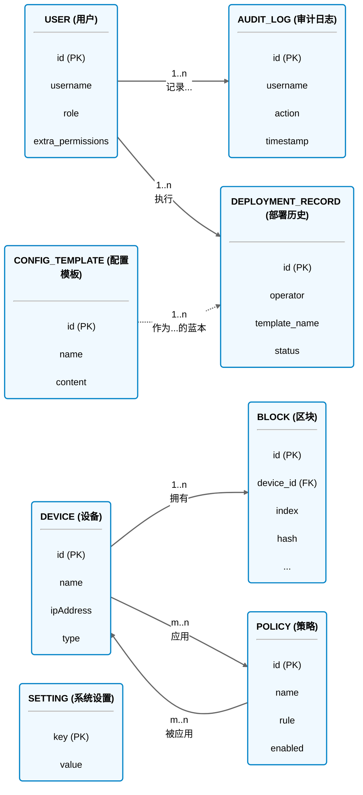

[图表建议 - 类型: 生成图]
[图表标题: 图3-5 系统数据库实体-关系图 (E-R Diagram)]
[图表描述: 使用更清晰的流程图语法重新绘制E-R图，以明确展示各实体及其关键属性，并通过带基数（Cardinality）说明的连接线来详细阐述实体间的“一对多”和“多对多”关系。]

#### **生成代码 (Mermaid)**

*注：`m..n` 代表多对多关系，在物理实现中通过`device_policy_association`中间表实现。`1..n` 代表一对多关系。*
