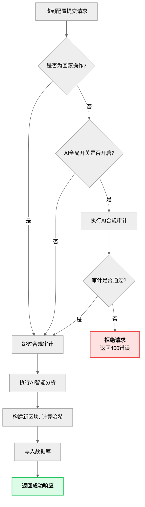

[图表建议 - 类型: 生成图]
[图表标题: 图4-1 AI事前治理变更拦截工作流图]
[图表描述: 绘制一张流程图来详细解释后端`perform_add_block`函数中的治理逻辑。流程从“收到配置提交请求”开始，经过一个菱形判断框“是否为回滚操作？”。如果是，则流程走向“跳过合规审计”；如果否，则走向“执行AI合规审计”。AI审计后再接一个判断框“审计是否通过？”。如果否，则流程走向“拒绝请求并返回错误”；如果是，则流程继续走向“执行AI智能分析”、“构建新区块”、“写入数据库”等后续步骤，最终“返回成功响应”。]

#### **生成代码 (Mermaid)**

---
config:
  theme: neutral
  fontFamily: sans-serif
  themeVariables:
    fontFamily: sans-serif
  layout: fixed
---
flowchart LR
    A["收到配置提交请求"] ==> B{"是否为回滚操作?"}
    B == 是 ==> F["跳过合规审计"]
    B == 否 ==> C{"AI审计开关 是否开启?"}
    C == 否 ==> F
    C == 是 ==> D["执行AI合规审计"]
    D ==> E{"审计是否通过?"}
    E == 否 ==> J["<b>拒绝请求</b> 返回400错误"]
    E == 是 ==> F
    F ==> G["AI智能分析 是否开启"]
    G == 否 ==> H["构建新区块, 计算哈希"]
    H ==> I["写入数据库"]
    I ==> K["<b>返回成功响应</b>"]
    n1[" "] == 是 ==> n3["生成分析报告"]
    n3 ==> H
    G@{ shape: diam}
    n1@{ shape: anchor}
    n3@{ shape: rect}
    style J fill:#fee2e2,stroke:#ef4444,stroke-width:2px
    style K fill:#dcfce7,stroke:#22c55e,stroke-width:2px
