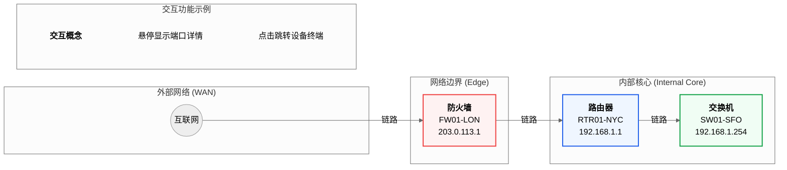

[图表建议 - 类型: 生成图]
[图表标题: 图6-1 未来网络拓扑可视化功能概念图]
[图表描述: 绘制一张未来“网络拓扑”视图的用户界面（UI）概念设计图。图中包含代表不同类型网络设备（互联网、防火墙、路由器、交换机）的图标节点，节点之间通过连线表示物理连接。通过子图将网络划分为不同区域，并为不同设备类型定义了颜色。最重要的是，右侧增加了一个“交互功能示例”注释框，用以传达悬停、点击等交互概念。]

#### **生成代码 (Mermaid)**

<!DOCTYPE html>
<html lang="zh-CN" data-theme="cyan" data-bg-theme="zinc">
<head>
    <meta charset="UTF-8">
    <meta name="viewport" content="width=device-width, initial-scale=1.0">
    <title>链踪 - 网络拓扑概念图</title>
    
    
</head>
<body class="bg-bg-950 text-text-300 font-sans">
    
    <!-- App Header -->
    <header class="bg-bg-900/70 backdrop-blur-sm shadow-lg sticky top-0 z-50 border-b border-bg-800/50">
        

            

                <svg xmlns="http://www.w3.org/2000/svg" class="h-8 w-8 text-primary-400" fill="none" viewBox="0 0 24 24" stroke="currentColor" stroke-width="2">
                    <path stroke-linecap="round" stroke-linejoin="round" d="M13.828 10.172a4 4 0 00-5.656 0l-4 4a4 4 0 105.656 5.656l1.102-1.101m-.758-4.899a4 4 0 005.656 0l4-4a4 4 0 00-5.656-5.656l-1.1 1.1"></path>
                </svg>
                

                    <h1 class="text-2xl font-bold text-text-100 tracking-tight">链踪</h1>
                    
网络配置守护者

                

            

            

                

                    已登录为
                    admin
                    admin
                

                <button class="text-text-400 hover:text-text-100 p-2 rounded-full hover:bg-bg-700 transition-colors">
                    <svg xmlns="http://www.w3.org/2000/svg" class="h-6 w-6" fill="none" viewBox="0 0 24 24" stroke="currentColor" stroke-width="2"><path stroke-linecap="round" stroke-linejoin="round" d="M10.325 4.317c.426-1.756 2.924-1.756 3.35 0a1.724 1.724 0 002.573 1.066c1.543-.94 3.31.826 2.37 2.37a1.724 1.724 0 001.065 2.572c1.756.426 1.756 2.924 0 3.35a1.724 1.724 0 00-1.066 2.573c.94 1.543-.826 3.31-2.37 2.37a1.724 1.724 0 00-2.572 1.065c-.426 1.756-2.924-1.756-3.35 0a1.724 1.724 0 00-2.573-1.066c-1.543.94-3.31-.826-2.37-2.37a1.724 1.724 0 00-1.065-2.572c-1.756-.426-1.756-2.924 0-3.35a1.724 1.724 0 001.066-2.573c-.94-1.543.826-3.31 2.37-2.37.996.608 2.296.07 2.572-1.065z"></path><path stroke-linecap="round" stroke-linejoin="round" d="M15 12a3 3 0 11-6 0 3 3 0 016 0z"></path></svg>
                </button>
            

        

    </header>

    <!-- Main Content -->
    <main class="container mx-auto p-4 md:p-8">
        

            <h2 class="text-3xl font-bold text-text-100">网络拓扑 (概念图)</h2>
        

        

            <!-- SVG Background for Links -->
            <svg class="absolute top-0 left-0 w-full h-full z-0" style="pointer-events: none;">
                <!-- Line from Internet to Firewall -->
                <line x1="10%" y1="50%" x2="25%" y2="50%" stroke="rgb(var(--color-bg-700))" stroke-width="2" stroke-dasharray="5,5"/>
                <text x="17.5%" y="48%" text-anchor="middle" fill="rgb(var(--color-text-400))" font-size="12">WAN 链路</text>
                
                <!-- Line from Firewall to Router -->
                <line x1="38%" y1="50%" x2="52%" y2="50%" stroke="rgb(var(--color-bg-700))" stroke-width="2"/>
                <text x="45%" y="48%" text-anchor="middle" fill="rgb(var(--color-text-400))" font-size="12">边界链路</text>

                <!-- Line from Router to Switch -->
                <line x1="65%" y1="50%" x2="79%" y2="50%" stroke="rgb(var(--color-bg-700))" stroke-width="2"/>
                <text x="72%" y="48%" text-anchor="middle" fill="rgb(var(--color-text-400))" font-size="12">核心链路</text>
            </svg>

            <!-- Network Nodes -->
            

                

                    <svg class="h-16 w-16 text-text-400" fill="none" viewBox="0 0 24 24" stroke="currentColor" stroke-width="1.5"><path stroke-linecap="round" stroke-linejoin="round" d="M21 12a9 9 0 01-9 9m9-9a9 9 0 00-9-9m9 9H3m9 9a9 9 0 01-9-9m9 9V3m0 18a9 9 0 009-9m-9 9a9 9 0 00-9-9"></path></svg>
                    

                        
互联网

                    

                

            

            

                

                    <svg class="h-12 w-12 text-red-400" fill="none" viewBox="0 0 24 24" stroke="currentColor" stroke-width="1.5"><path stroke-linecap="round" stroke-linejoin="round" d="M12 15v2m-6 4h12a2 2 0 002-2v-6a2 2 0 00-2-2H6a2 2 0 00-2 2v6a2 2 0 002 2zm10-10V7a4 4 0 00-8 0v4h8z"></path></svg>
                    

                        
防火墙

                        
FW01-LON

                        
203.0.113.1

                    

                

            

            

                

                    <svg class="h-12 w-12 text-blue-400" fill="none" viewBox="0 0 24 24" stroke="currentColor" stroke-width="1.5"><path stroke-linecap="round" stroke-linejoin="round" d="M8.25 3v1.5M4.5 8.25H3m18 0h-1.5M4.5 12H3m18 0h-1.5m-15 3.75H3m18 0h-1.5M8.25 21v-1.5M15.75 3v1.5M12 4.5v15M15.75 21v-1.5"></path></svg>
                    

                        
路由器

                        
RTR01-NYC

                        
192.168.1.1

                    

                    <!-- Tooltip for demonstration -->
                    

                        
本地端口: GigabitEthernet0/1

                        
远端端口: GigabitEthernet1/1

                        

                    

                

            

            
            

                

                    <svg class="h-12 w-12 text-green-400" fill="none" viewBox="0 0 24 24" stroke="currentColor" stroke-width="1.5"><path stroke-linecap="round" stroke-linejoin="round" d="M6 18L18 6M6 6l12 12"></path><path stroke-linecap="round" stroke-linejoin="round" d="M15.042 21.672L13.684 16.6m0 0l-2.51 2.225.569-2.467-1.75-1.635 2.44-.351L12 9.5l1.056 2.148 2.44.351-1.75 1.635.569 2.467-2.51-2.225z"></path></svg>
                    

                        
交换机

                        
SW01-SFO

                        
192.168.1.254

                    

                

            

            <!-- Interactive Concept Box -->
            

                <h4 class="font-bold text-text-100 flex items-center gap-2 mb-2">
                    <svg xmlns="http://www.w3.org/2000/svg" class="h-5 w-5 text-primary-400" fill="none" viewBox="0 0 24 24" stroke="currentColor" stroke-width="2"><path stroke-linecap="round" stroke-linejoin="round" d="M15.042 21.672L13.684 16.6m0 0l-2.51 2.225.569-2.467-1.75-1.635 2.44-.351L12 9.5l1.056 2.148 2.44.351-1.75 1.635.569 2.467-2.51-2.225z" /></svg>
                    交互功能概念
                </h4>
                <ul class="space-y-2 text-sm text-text-300">
                    <li class="flex items-start gap-2">
                        <svg xmlns="http://www.w3.org/2000/svg" class="h-4 w-4 mt-0.5 text-text-400 flex-shrink-0" fill="none" viewBox="0 0 24 24" stroke="currentColor" stroke-width="2"><path stroke-linecap="round" stroke-linejoin="round" d="M13 16h-1v-4h-1m1-4h.01M21 12a9 9 0 11-18 0 9 9 0 0118 0z" /></svg>
                        悬停在节点或链路上，显示端口、状态等详细信息。
                    </li>
                    <li class="flex items-start gap-2">
                        <svg xmlns="http://www.w3.org/2000/svg" class="h-4 w-4 mt-0.5 text-text-400 flex-shrink-0" fill="none" viewBox="0 0 24 24" stroke="currentColor" stroke-width="2"><path stroke-linecap="round" stroke-linejoin="round" d="M15 15l-2 5L9 9l11 4-5 2z" /></svg>
                        点击任意设备节点，直接跳转至该设备的交互式终端。
                    </li>
                </ul>
            

        

    </main>

</body>
</html>
