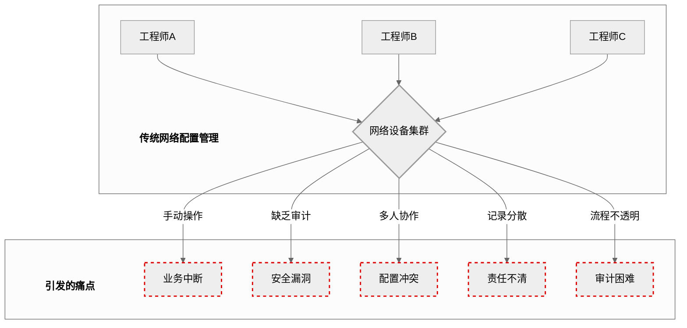
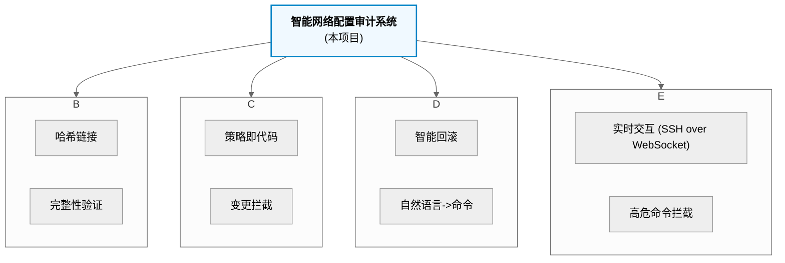
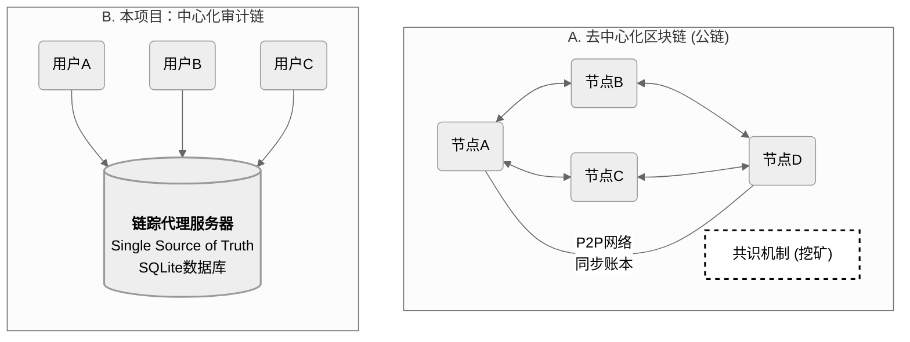
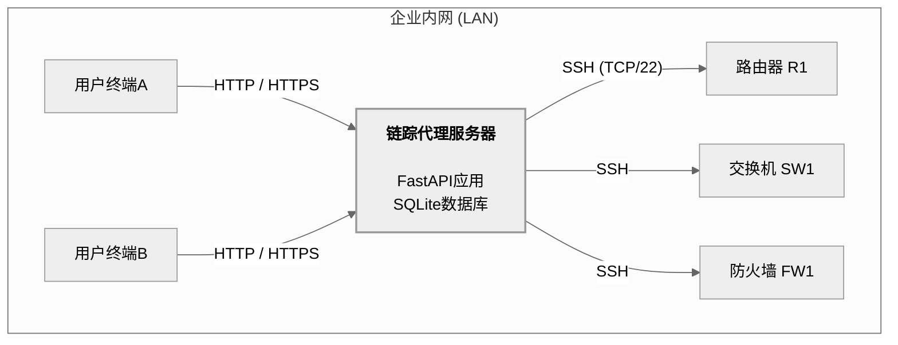
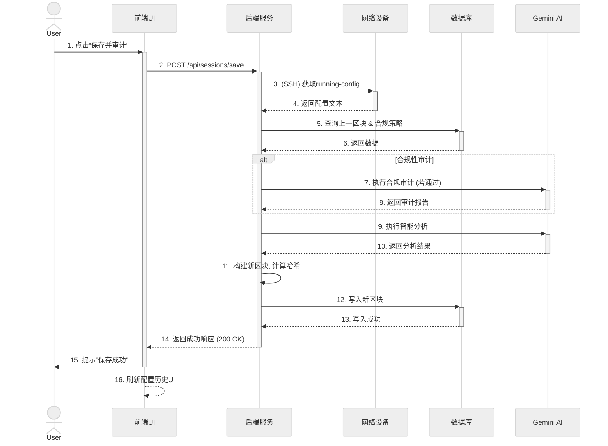
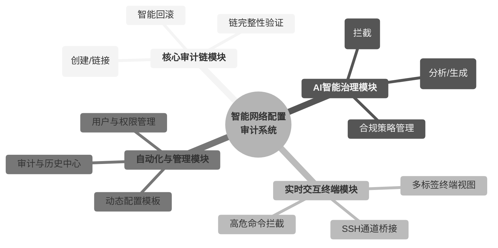
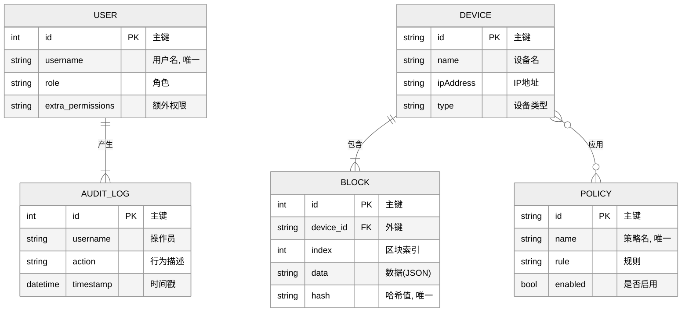
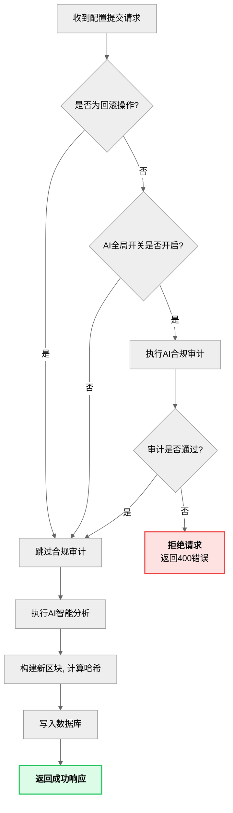
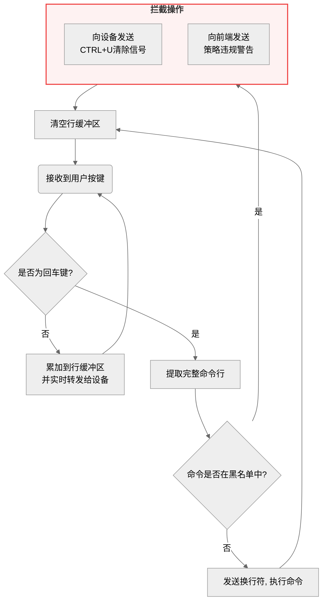
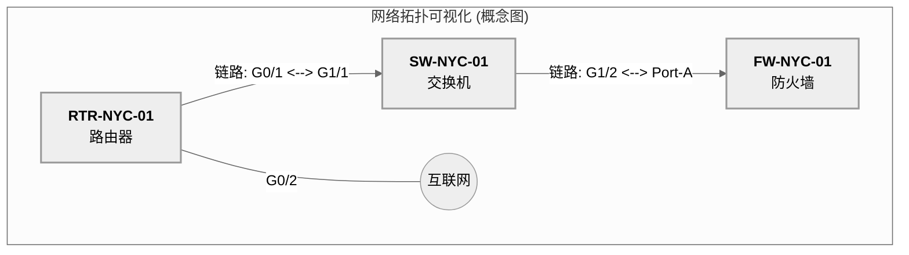

# 论文生成图建议及代码汇总

本文档汇总了毕业论文各章节中所有类型为“生成图”的图表建议，并为每一项提供了可直接用于生成图表的 **Mermaid.js** 代码（适用于流程图、架构图等）或 **Markdown** 代码（适用于表格）。

您可以将相应的代码块复制到支持的编辑器中（如 [Mermaid Live Editor](https://mermaid.live) 或 Typora/VS Code等Markdown编辑器）来生成图片。

---

## **第一章 绪论**

### **1. 图1-1 传统网络配置管理痛点示意图**

[图表建议 - 类型: 生成图]
[图表标题: 图1-1 传统网络配置管理痛点示意图]
[图表描述: 绘制一幅概念图，中心是一个“网络设备集群”，周围环绕着多个代表“网络工程师”的人物图标，他们都指向中心集群。从集群中引出多个带有“爆炸”或“警告”图标的气泡，分别标注“业务中断”、“安全漏洞”、“配置冲突”、“责任不清”、“审计困难”等关键词。整个图的风格应简洁明了，突出传统模式的混乱与风险。]

#### **生成代码 (Mermaid)**



---

### **2. 表1-1 不同网络管理方案对比表**

[图表建议 - 类型: 生成图]
[图表标题: 表1-1 不同网络管理方案对比表]
[图表描述: 创建一个对比表格。行（Row）为评估维度，例如：“版本控制”、“自动化执行”、“事前审计”、“记录不可篡改性”、“智能化水平”、“协作能力”。列（Column）为不同类型的方案，例如：“传统手动运维”、“Rancid类备份工具”、“Ansible类自动化工具”、“传统商业NCM”、“本项目‘链踪’”。使用“优/良/中/差”或星级（⭐）来填充单元格，以直观地突出本项目在整合创新、特别是不可篡改性和智能化方面的综合优势。]

#### **生成代码 (Markdown Table)**

| 评估维度 | 传统手动运维 | Rancid类备份工具 | Ansible类自动化工具 | 传统商业NCM | 本项目“链踪” |
| :--- | :---: | :---: | :---: | :---: | :---: |
| **版本控制** | 差 (❌) | 良 (✔️) | 优 (✔️✔️) | 优 (✔️✔️) | **卓越 (⭐️)** |
| **自动化执行** | 差 (❌) | 差 (❌) | 优 (✔️✔️) | 良 (✔️) | **良 (✔️)** |
| **事前审计** | 差 (❌) | 差 (❌) | 差 (❌) | 良 (✔️) | **卓越 (⭐️)** |
| **记录不可篡改性**| 差 (❌) | 差 (❌) | 差 (❌) | 差 (❌) | **卓越 (⭐️)** |
| **智能化水平** | 差 (❌) | 差 (❌) | 差 (❌) | 中 (✔️) | **卓越 (⭐️)** |
| **团队协作能力** | 差 (❌) | 中 (✔️) | 良 (✔️) | 良 (✔️) | **优 (✔️✔️)** |

---

### **3. 图1-2 本文主要研究内容关系图**

[图表建议 - 类型: 生成图]
[图表标题: 图1-2 本文主要研究内容关系图]
[图表描述: 绘制一个中心为“智能网络配置审计系统”的思维导图或关系图。从中心引出四个主要分支，分别对应本节的四个研究工作：“不可变审计链”、“AI事前治理”、“AI辅助工作流”、“安全交互终端”。每个分支下再细分出1-2个关键词，如“哈希链接”、“策略即代码”、“智能回滚”、“命令拦截”等，以展示研究工作的内在逻辑和覆盖范围。]

#### **生成代码 (Mermaid)**



---

## **第二章 系统相关技术概述**

### **1. 图2-2 中心化审计链与去中心化区块链对比图**

[图表建议 - 类型: 生成图]
[图表标题: 图2-2 中心化审计链与去中心化区块链对比图]
[图表描述: 绘制一张左右对比图。左侧标题为“去中心化区块链（公链）”，图中画出多个互相连接的节点（电脑图标），节点之间通过P2P网络连接，共同维护一份分布式账本，并突出“共识机制（挖矿）”这一环节。右侧标题为“本项目：中心化审计链”，图中画一个中心的“链踪代理服务器”图标，所有“用户终端”都指向它，服务器内部包含数据库图标，表示数据由单一权威源管理。以此清晰地区分两种模式在架构上的根本不同。]

#### **生成代码 (Mermaid)**



---

### **2. 图2-4 FastAPI应用与ASGI服务器关系示意图**

[图表建议 - 类型: 生成图]
[图表标题: 图2-4 FastAPI应用与ASGI服务器关系示意图]
[图表描述: 绘制一张简单的分层图。最顶层是“客户端（浏览器）”，中间层是“ASGI服务器（如Uvicorn）”，最底层是“FastAPI应用”。用箭头表示HTTP请求从客户端发出，由Uvicorn接收并传递给FastAPI应用进行处理，然后响应再沿相反路径返回。图中突出FastAPI处理请求的核心能力，如“路径操作”、“数据校验”和“异步处理”。]

#### **生成代码 (Mermaid)**

```mermaid
%%{init: {'theme': 'neutral', 'fontFamily': 'sans-serif'}}%%
graph TD
    Client[<fa:fa-window-maximize> 客户端 (浏览器)]
    
    subgraph "服务器环境"
        Uvicorn[<fa:fa-server> ASGI服务器 (Uvicorn)]
        FastAPI[<fa:fa-code> <b>FastAPI 应用</b>]
        
        subgraph FastAPI_Internal["FastAPI 核心能力"]
            direction LR
            P["路径操作 / 路由"]
            V["数据校验 (Pydantic)"]
            A["异步处理 (Asyncio)"]
        end
        
        FastAPI --> FastAPI_Internal
    end
    
    Client -- "HTTP 请求" --> Uvicorn
    Uvicorn -- "传递请求 (ASGI协议)" --> FastAPI
    FastAPI -- "返回响应 (ASGI协议)" --> Uvicorn
    Uvicorn -- "HTTP 响应" --> Client
```

---

## **第三章 智能网络配置审计系统总体设计**

### **1. 图3-1 系统物理部署架构图**

[图表建议 - 类型: 生成图]
[图表标题: 图3-1 系统物理部署架构图]
[图表描述: 绘制一张网络拓扑图。图中应包含一个代表“企业内网”的云状或矩形边界。边界内包含三个主要部分：1. 左侧是多个“用户终端”（电脑图标），通过HTTP/HTTPS连接。2. 中间是核心的“链踪代理服务器”（服务器图标），服务器上标注运行着FastAPI应用和SQLite数据库。3. 右侧是多个“被管网络设备”（路由器、交换机图标），代理服务器通过SSH协议连接到这些设备。箭头清晰地标明通信协议和方向。]

#### **生成代码 (Mermaid)**



---

### **2. 图3-2 前后端分离应用架构图**

[图表建议 - 类型: 生成图]
[图表标题: 图3-2 前后端分离应用架构图]
[图表描述: 绘制一张分层架构图。从上到下依次为：1. 表现层（前端React应用，运行于浏览器）；2. 接口层（RESTful API & WebSocket）；3. 业务逻辑层（后端FastAPI应用，包含服务模块）；4. 数据持久层（SQLite数据库）；5. 外部服务层（Google Gemini AI模型）和基础设施层（被管网络设备）。使用箭头清晰地表示各层之间的调用关系和数据流向。]

#### **生成代码 (Mermaid)**

```mermaid
%%{init: {'theme': 'neutral', 'fontFamily': 'sans-serif'}}%%
graph TD
    subgraph "表现层"
        UI[<fa:fa-react> <b>前端 React 应用</b><br>(运行于浏览器)]
    end
    
    subgraph "接口层"
        API["<b>RESTful API / WebSocket</b>"]
    end
    
    subgraph "业务逻辑层 (后端)"
        Backend[<fa:fa-python> <b>FastAPI 应用</b><br>(Services, CRUD, Core)]
    end
    
    subgraph "数据持久层"
        DB[<fa:fa-database> <b>SQLite 数据库</b>]
    end
    
    subgraph "外部服务与基础设施"
        AI[<fa:fa-robot> Google Gemini AI API]
        Devices[<fa:fa-network-wired> 被管网络设备]
    end
    
    UI <-->|双向通信| API
    API <-->|调用/响应| Backend
    Backend -->|SQLAlchemy ORM<br>(读写)| DB
    Backend -->|HTTPS API 调用| AI
    Backend -->|SSH 连接<br>(Netmiko)| Devices
```

---

### **3. 图3-3 “保存会话并审计”操作序列图**

[图表建议 - 类型: 生成图]
[图表标题: 图3-3 “保存会话并审计”操作序列图]
[图表描述: 绘制一张UML序列图。参与者（Lifeline）包括：用户（Actor）、前端UI、后端API、网络设备、Gemini AI、数据库。序列从用户点击“保存并审计”按钮开始，详细展示消息的传递顺序：1. 前端向后端发送API请求。2. 后端连接网络设备获取配置。3. 后端向数据库查询历史数据和策略。4. 后端调用Gemini AI进行审计。5. 后端构建新区块并写入数据库。6. 后端向前端返回成功响应。7. 前端刷新UI。]

#### **生成代码 (Mermaid)**



---

### **4. 图3-4 系统功能模块结构图**

[图表建议 - 类型: 生成图]
[图表标题: 图3-4 系统功能模块结构图]
[图表描述: 绘制一个层次化的功能模块图。顶层为“智能网络配置审计系统”。下一层分解为四大核心模块：“核心审计链模块”、“AI智能治理模块”、“实时交互终端模块”、“自动化与管理模块”。每个核心模块下再细分出2-3个关键子功能，例如“核心审计链模块”下包含“区块管理”和“链完整性验证”；“AI智能治理模块”下包含“事前审计引擎”和“AI辅助工作流”等。]

#### **生成代码 (Mermaid)**



---

### **5. 图3-5 系统数据库实体-关系图 (E-R Diagram)**

[图表建议 - 类型: 生成图]
[图表标题: 图3-5 系统数据库实体-关系图 (E-R Diagram)]
[图表描述: 使用Crow's Foot（乌鸦脚）表示法绘制E-R图。图中应包含以下核心实体：User, Device, Block, Policy, AuditLog, ConfigTemplate, DeploymentRecord。清晰地表示它们之间的关系：Device与Block（一对多）、以及Device与Policy之间的多对多关系（通过一个名为'device_policy_association'的关联实体/表来表示）。每个实体应标注出其主要属性（如id, name等）。]

#### **生成代码 (Mermaid)**


*注：`o--o` 符号在Mermaid中用于表示多对多关系。在物理实现中，`DEVICE`与`POLICY`的多对多关系通过`device_policy_association`中间表实现。*

---

### **6. 表3-1 至 表3-5 核心数据表结构**

[图表建议 - 类型: 生成图]
[图表标题: 表3-1 至 表3-5 核心数据表结构]
[图表描述: 分别为users, devices, blocks, policies, 和 device_policy_association 这五张核心数据表创建结构清晰的表格。每张表格应包含三列：“字段名”、“数据类型”和“描述/约束”。例如，在blocks表中，应列出id, device_id, index, timestamp, data, prev_hash, hash等字段，并注明其数据类型（如INTEGER, TEXT）和约束（如主键, 外键, 非空, 唯一）。]

#### **生成代码 (Markdown Table)**

**表3-1 `users` 表**
| 字段名 | 数据类型 | 描述/约束 |
| :--- | :--- | :--- |
| id | INTEGER | 主键，自增 |
| username | TEXT | 用户名，唯一，非空 |
| password | TEXT | 密码，非空 |
| role | TEXT | 角色 (admin/operator)，非空 |
| extra_permissions| TEXT | 额外权限（逗号分隔），可为空 |

**表3-2 `devices` 表**
| 字段名 | 数据类型 | 描述/约束 |
| :--- | :--- | :--- |
| id | TEXT | 主键，设备唯一ID |
| name | TEXT | 设备名称，非空 |
| ipAddress | TEXT | IP地址，非空 |
| type | TEXT | 设备类型，非空 |

**表3-3 `blocks` 表**
| 字段名 | 数据类型 | 描述/约束 |
| :--- | :--- | :--- |
| id | INTEGER | 主键，自增 |
| device_id | TEXT | 外键，关联 `devices.id` |
| index | INTEGER | 区块索引，非空 |
| timestamp | TEXT | 时间戳 (ISO 8601)，非空 |
| data | TEXT | 区块业务数据 (JSON字符串)，非空 |
| prev_hash | TEXT | 前一区块哈希，非空 |
| hash | TEXT | 当前区块哈希，唯一，非空 |

**表3-4 `policies` 表**
| 字段名 | 数据类型 | 描述/约束 |
| :--- | :--- | :--- |
| id | TEXT | 主键，策略唯一ID |
| name | TEXT | 策略名称，唯一，非空 |
| severity | TEXT | 严重性，非空 |
| description | TEXT | 描述，非空 |
| rule | TEXT | 规则 (自然语言)，非空 |
| enabled | BOOLEAN | 是否启用，非空，默认True |

**表3-5 `device_policy_association` 表**
| 字段名 | 数据类型 | 描述/约束 |
| :--- | :--- | :--- |
| device_id | TEXT | 复合主键，外键，关联 `devices.id` |
| policy_id | TEXT | 复合主键，外键，关联 `policies.id` |

---

## **第四章 核心功能模块的实现**

### **1. 图4-1 AI事前治理变更拦截工作流图**

[图表建议 - 类型: 生成图]
[图表标题: 图4-1 AI事前治理变更拦截工作流图]
[图表描述: 绘制一张流程图来详细解释后端`perform_add_block`函数中的治理逻辑。流程从“收到配置提交请求”开始，经过一个菱形判断框“是否为回滚操作？”。如果是，则流程走向“跳过合规审计”；如果否，则走向“执行AI合规审计”。AI审计后再接一个判断框“审计是否通过？”。如果否，则流程走向“拒绝请求并返回错误”；如果是，则流程继续走向“执行AI智能分析”、“构建新区块”、“写入数据库”等后续步骤，最终“返回成功响应”。]

#### **生成代码 (Mermaid)**



---

### **2. 图4-2 交互式终端高危命令拦截机制流程图**

[图表建议 - 类型: 生成图]
[图表标题: 图4-2 交互式终端高危命令拦截机制流程图]
[图表描述: 绘制一张流程图来解释后端`unified_io_handler`中的命令拦截逻辑。流程从“接收到用户按键”开始。经过一个判断框“是否为回车键？”。如果否，则“累加到行缓冲区并转发给设备”。如果是，则提取行缓冲区内容，经过一个判断框“命令是否在黑名单中？”。如果否，则“正常发送换行符执行命令”。如果是，则走向“向设备发送CTRL+U清除信号”、“向前端发送违规警告”，最终都回到“清空行缓冲区”并等待下一次输入。]

#### **生成代码 (Mermaid)**



---

## **第六章 总结与展望**

### **1. 图6-1 未来网络拓扑可视化功能概念图**

[图表建议 - 类型: 生成图]
[图表标题: 图6-1 未来网络拓扑可视化功能概念图]
[图表描述: 绘制一张未来“网络拓扑”视图的用户界面（UI）概念设计图。图中应包含多个代表不同类型网络设备（路由器、交换机）的图标节点，节点之间通过连线表示物理连接。当鼠标悬停在一条连线上时，旁边应出现一个工具提示框，显示连接的两端接口信息（如G0/1 <--> G0/2）。节点应可点击，以模拟跳转到设备详情页的交互。]

#### **生成代码 (Mermaid)**

