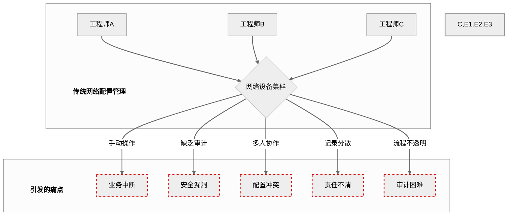

# 论文生成图建议及代码汇总

本文档汇总了毕业论文各章节中所有类型为“生成图”的图表建议，并为每一项提供了可直接用于生成图表的 **Mermaid.js** 代码（适用于流程图、架构图等）或 **Markdown** 代码（适用于表格）。

您可以将相应的代码块复制到支持的编辑器中（如 [Mermaid Live Editor](https://mermaid.live) 或 Typora/VS Code等Markdown编辑器）来生成图片。

---

## **第一章 绪论**

### **1. 图1-1 传统网络配置管理痛点示意图**

[图表建议 - 类型: 生成图]
[图表标题: 图1-1 传统网络配置管理痛点示意图]
[图表描述: 绘制一幅概念图，中心是一个“网络设备集群”，周围环绕着多个代表“网络工程师”的人物图标，他们都指向中心集群。从集群中引出多个带有“爆炸”或“警告”图标的气泡，分别标注“业务中断”、“安全漏洞”、“配置冲突”、“责任不清”、“审计困难”等关键词。整个图的风格应简洁明了，突出传统模式的混乱与风险。]

#### **生成代码 (Mermaid)**

