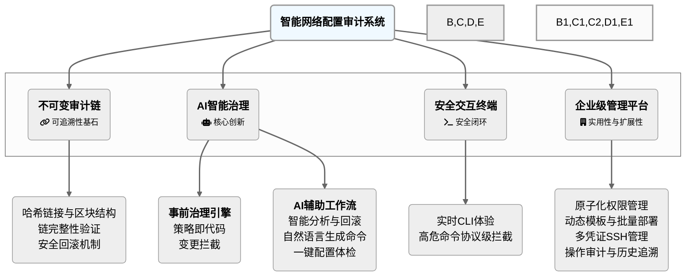

### **3. 图1-2 本文主要研究内容关系图**

[图表建议 - 类型: 生成图]
[图表标题: 图1-2 本文主要研究内容关系图]
[图表描述: 绘制一个中心为“智能网络配置审计系统”的思维导图或关系图。从中心引出四个主要分支，分别对应本节的四个研究工作：“不可变审计链”、“AI事前治理”、“AI辅助工作流”、“安全交互终端”。每个分支下再细分出1-2个关键词，如“哈希链接”、“策略即代码”、“智能回滚”、“命令拦截”等，以展示研究工作的内在逻辑和覆盖范围。]

#### **生成代码 (Mermaid)**

