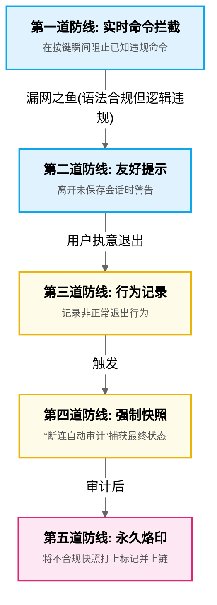

[图表建议 - 类型: 生成图] 
[图表标题: 图3-6 五道“法证级”防线安全模型] 
[图表描述: 绘制一张层次化的流程图，从上到下依次展示五道防线。每一层都应有清晰的标题和简短的功能描述。]

#### **生成代码 (Mermaid)**

```mermaid
%%{init: {'theme': 'neutral', 'fontFamily': 'sans-serif'}}%%
graph TD
    A["<b>第一道防线: 实时命令拦截</b><br><span style='font-size:12px; color:#555;'>在按键瞬间阻止已知违规命令</span>"]:::level1
    A -- "漏网之鱼(语法合规但逻辑违规)" --> B
    B["<b>第二道防线: 友好提示</b><br><span style='font-size:12px; color:#555;'>离开未保存会话时警告</span>"]:::level2
    B -- "用户执意退出" --> C
    C["<b>第三道防线: 行为记录</b><br><span style='font-size:12px; color:#555;'>记录非正常退出行为</span>"]:::level3
    C -- "触发" --> D
    D["<b>第四道防线: 强制快照</b><br><span style='font-size:12px; color:#555;'>“断连自动审计”捕获最终状态</span>"]:::level4
    D -- "审计后" --> E
    E["<b>第五道防线: 永久烙印</b><br><span style='font-size:12px; color:#555;'>将不合规快照打上标记并上链</span>"]:::level5

    classDef level1 fill:#e0f2fe,stroke:#0ea5e9,stroke-width:2px;
    classDef level2 fill:#e0f2fe,stroke:#0ea5e9,stroke-width:2px;
    classDef level3 fill:#fefce8,stroke:#eab308,stroke-width:2px;
    classDef level4 fill:#fefce8,stroke:#eab308,stroke-width:2px;
    classDef level5 fill:#fce7f3,stroke:#db2777,stroke-width:2px;
```
