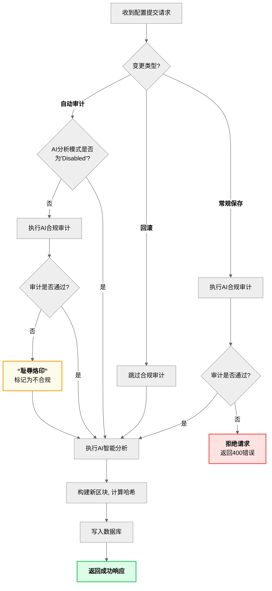

[图表建议 - 类型: 生成图]
[图表标题: 图4-2 AI事前治理变更拦截工作流图]
[图表描述: 绘制一张流程图，详细解释后端`perform_add_block`函数中，针对不同变更类型（常规保存、自动审计、回滚）的差异化治理逻辑。流程图清晰地展示了常规更新的“不合规即拦截”原则、回滚操作的“审计豁免”原则，以及自动审计的“无论合规与否皆记录”（耻辱烙印）的法证级审计闭环。]

#### **生成代码 (Mermaid)**

