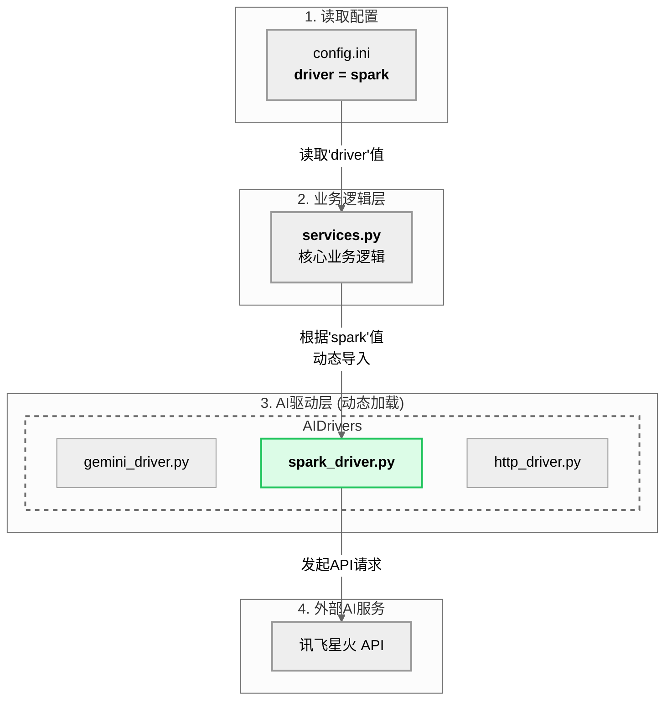

[图表建议 - 类型: 生成图]
[图表标题: 图4-1 可插拔AI驱动架构示意图]
[图表描述: 绘制一张架构图。中心是“`services.py` (业务逻辑层)”，它有一个指向“`config.ini` (配置)”的读取箭头。`config.ini`中突出`driver = spark`的配置。根据这个配置，一个箭头从`services.py`指向一个名为“`ai_drivers`模块”的方框。该方框内并列包含三个子模块：“`gemini_driver`”、“`spark_driver`”和“`http_driver`”，其中`spark_driver`被高亮。这直观地展示了系统如何根据配置动态选择并加载AI驱动。]

#### **生成代码 (Mermaid)**

