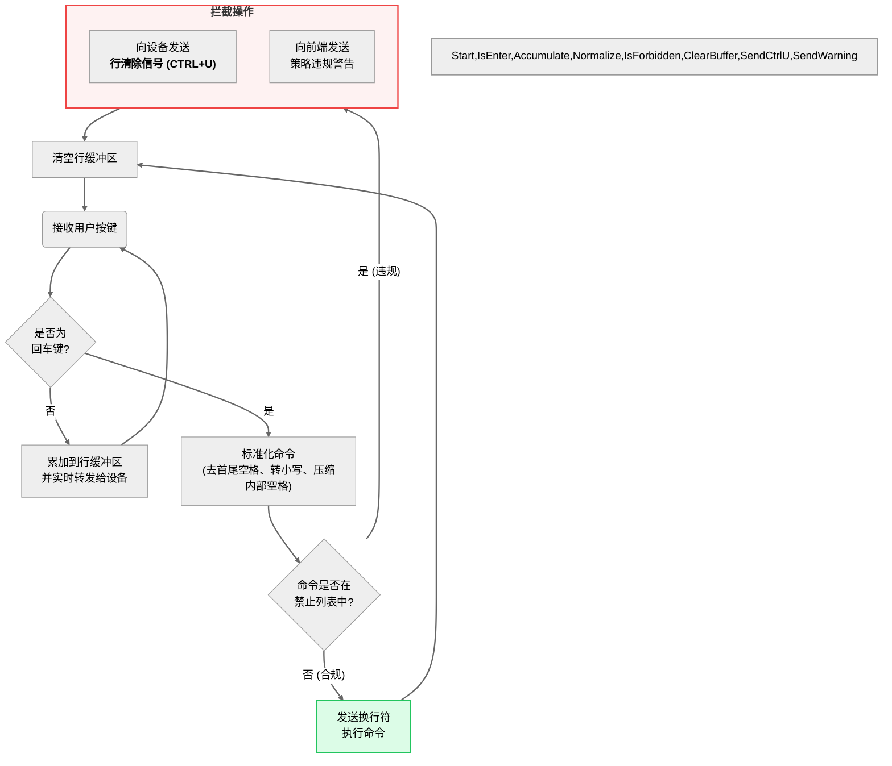

### **2. 图4-2 交互式终端高危命令拦截机制流程图**

[图表建议 - 类型: 生成图]
[图表标题: 图4-2 交互式终端高危命令拦截机制流程图]
[图表描述: 绘制一张流程图来解释后端`unified_io_handler`中的命令拦截逻辑。流程从“接收到用户按键”开始。经过一个判断框“是否为回车键？”。如果否，则“累加到行缓冲区并转发给设备”。如果是，则提取行缓冲区内容，并对其进行标准化处理，然后判断是否在黑名单中。如果否，则“正常发送换行符执行命令”。如果是，则走向“向设备发送CTRL+U清除信号”、“向前端发送违规警告”，最终都回到“清空行缓冲区”并等待下一次输入。]

#### **生成代码 (Mermaid)**

