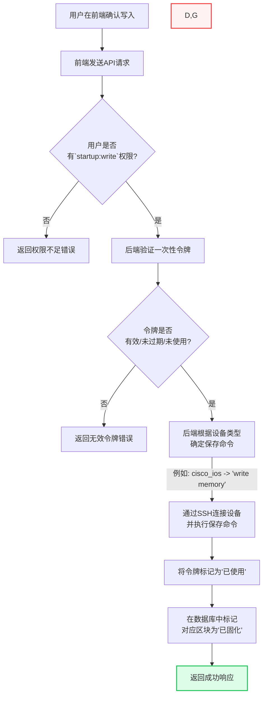

[图表建议 - 类型: 生成图]
[图表标题: 图4-3 “安全写入启动配置”工作流]
[图表描述: 绘制一张流程图，详细描述用户从请求写入启动配置到最终完成的完整、安全的工作流。流程从“用户点击‘是’（同意写入）”开始，依次经过“检查`startup:write`权限”、“请求/输入一次性令牌”、“后端验证令牌”，如果全部通过，则由“后端根据设备类型发送保存命令”，最终“标记区块为已固化”并“返回成功”。在权限和令牌验证失败时，流程应走向“返回错误/提示”。]

#### **生成代码 (Mermaid)**

