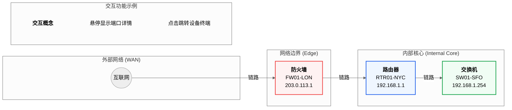

### **1. 图6-1 未来网络拓扑可视化功能概念图**

[图表建议 - 类型: 生成图]
[图表标题: 图6-1 未来网络拓扑可视化功能概念图]
[图表描述: 绘制一张未来“网络拓扑”视图的用户界面（UI）概念设计图。图中包含代表不同类型网络设备（互联网、防火墙、路由器、交换机）的图标节点，节点之间通过连线表示物理连接。通过子图将网络划分为不同区域，并为不同设备类型定义了颜色。最重要的是，右侧增加了一个“交互功能示例”注释框，用以传达悬停、点击等交互概念。]

#### **生成代码 (Mermaid)**

