# 论文生成图建议及代码汇总 (V11.x 最终版)

本文档汇总了毕业论文各章节中所有类型为“生成图”的图表建议，并为每一项提供了可直接用于生成图表的 **Mermaid.js** 代码（适用于流程图、架构图等）或 **Markdown** 代码（适用于表格）。

您可以将相应的代码块复制到支持的编辑器中（如 [Mermaid Live Editor](https://mermaid.live) 或 Typora/VS Code等Markdown编辑器）来生成图片。

---

## **第一章 绪论**

### **1. 图1-1 传统网络配置管理痛点示意图**

[图表建议 - 类型: 生成图]
[图表标题: 图1-1 传统网络配置管理痛点示意图]
[图表描述: 绘制一幅概念图，中心是一个“网络设备集群”，周围环绕着多个代表“网络工程师”的人物图标，他们都指向中心集群。从集群中引出多个带有“爆炸”或“警告”图标的气泡，分别标注“业务中断”、“安全漏洞”、“配置冲突”、“责任不清”、“审计困难”等关键词。整个图的风格应简洁明了，突出传统模式的混乱与风险。]

#### **生成代码 (Mermaid)**

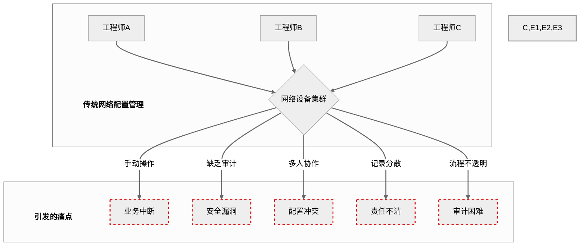

---

### **2. 表1-1 不同网络管理方案对比表**

[图表建议 - 类型: 生成图]
[图表标题: 表1-1 不同网络管理方案对比表]
[图表描述: 创建一个对比表格。行（Row）为评估维度，例如：“版本控制”、“自动化执行”、“事前审计”、“记录不可篡改性”、“智能化水平”、“协作能力”。列（Column）为不同类型的方案，例如：“传统手动运维”、“Rancid类备份工具”、“Ansible类自动化工具”、“传统商业NCM”、“本项目‘链踪’”。使用“优/良/中/差”或星级（⭐）来填充单元格，以直观地突出本项目在整合创新、特别是不可篡改性和智能化方面的综合优势。]

#### **生成代码 (Markdown Table)**

| 评估维度 | 传统手动运维 | Rancid类备份工具 | Ansible类自动化工具 | 传统商业NCM | 本项目“链踪” |
| :--- | :---: | :---: | :---: | :---: | :---: |
| **版本控制** | 差 (❌) | 良 (✔️) | 优 (✔️✔️) | 优 (✔️✔️) | **卓越 (⭐️)** |
| **自动化执行** | 差 (❌) | 差 (❌) | 优 (✔️✔️) | 良 (✔️) | **良 (✔️)** |
| **事前审计** | 差 (❌) | 差 (❌) | 差 (❌) | 良 (✔️) | **卓越 (⭐️)** |
| **记录不可篡改性**| 差 (❌) | 差 (❌) | 差 (❌) | 差 (❌) | **卓越 (⭐️)** |
| **智能化水平** | 差 (❌) | 差 (❌) | 差 (❌) | 中 (✔️) | **卓越 (⭐️)** |
| **团队协作能力** | 差 (❌) | 中 (✔️) | 良 (✔️) | 良 (✔️) | **优 (✔️✔️)** |

---

### **3. 图1-2 本文主要研究内容关系图**

[图表建议 - 类型: 生成图]
[图表标题: 图1-2 本文主要研究内容关系图]
[图表描述: 绘制一个中心为“智能网络配置审计系统”的思维导图或关系图。从中心引出四个主要分支，分别对应本节的四个研究工作：“不可变审计链”、“AI事前治理”、“AI辅助工作流”、“安全交互终端”。每个分支下再细分出1-2个关键词，如“哈希链接”、“策略即代码”、“智能回滚”、“命令拦截”等，以展示研究工作的内在逻辑和覆盖范围。]

#### **生成代码 (Mermaid)**

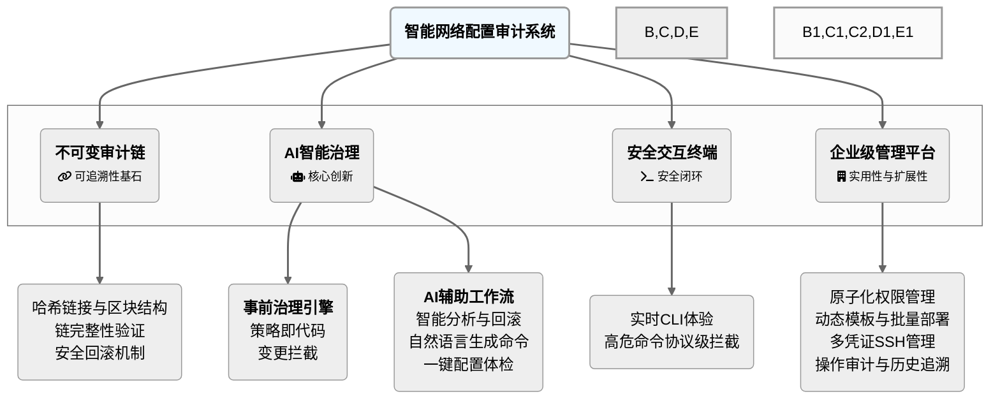

---

## **第二章 系统相关技术概述**

### **1. 图2-2 中心化审计链与去中心化区块链对比图**

[图表建议 - 类型: 生成图]
[图表标题: 图2-2 中心化审计链与去中心化区块链对比图]
[图表描述: 绘制一张左右对比图。左侧标题为“去中心化区块链（公链）”，图中画出多个互相连接的节点（电脑图标），节点之间通过P2P网络连接，共同维护一份分布式账本，并突出“共识机制（挖矿）”这一环节。右侧标题为“本项目：中心化智能审计链”，图中以“链踪代理”为核心，展示其作为单一权威源，如何接收用户请求，并协同AI模型、真实网络设备和数据库来完成AI治理与哈希链接等核心业务，以此清晰地区分两种模式在架构上的根本不同。]

#### **生成代码 (Mermaid)**

```mermaid
%%{init: {'theme': 'neutral', 'fontFamily': 'sans-serif'}}%%
graph TD
    subgraph "A. 去中心化区块链 (公链)"
        direction LR
        N1(<fa:fa-laptop> 节点A) <--> N2(<fa:fa-laptop> 节点B);
        N1 <--> N3(<fa:fa-laptop> 节点C);
        N2 <--> N4(<fa:fa-laptop> 节点D);
        N3 <--> N4;
        N1 -- "P2P网络<br>同步账本" --- N4;
        C["<fa:fa-cogs> 共识机制 (挖矿)"]:::emphasis;
    end
    
    subgraph "B. 本项目：中心化智能审计链"
        direction TD
        
        User[<fa:fa-user> 用户 (React前端)];

        subgraph Agent["<b>链踪代理 (FastAPI 后端)</b><br><fa:fa-server> 权威事实源 (Single Source of Truth)</fa:fa-server>"]
            direction LR
            Logic["<b>核心业务逻辑</b><br><fa:fa-cogs></fa:fa-cogs><br>AI治理<br>哈希链接"];
        end
        
        User --> Agent;
        Agent -->|SSH (Netmiko)| Devices[<fa:fa-network-wired> 网络设备];
        Agent -->|API调用| AI[<fa:fa-robot> AI模型 (讯飞星火)];
        Agent -->|SQLAlchemy| DB[<fa:fa-database> 审计链数据库 (SQLite)];
    end

    linkStyle default stroke-width:2px
    classDef emphasis fill:#fff,stroke:#000,stroke-width:2px,stroke-dasharray: 5 5,color:black;
    style Agent,Logic,User,Devices,AI,DB,N1,N2,N3,N4 stroke-width:2px
```

---

### **2. 图2-4 “链踪”后端架构与工作流程示意图**

[图表建议 - 类型: 生成图]
[图表标题: 图2-4 “链踪”后端架构与工作流程示意图]
[图表描述: 绘制一张分层架构图，展示用户请求通过ASGI服务器到达FastAPI应用后，如何在API层（路由）、业务逻辑层（服务）和数据访问层（CRUD）之间流转，并最终与外部依赖（网络设备、AI模型、数据库）交互的完整流程。]

#### **生成代码 (Mermaid)**

```mermaid
%%{init: {'theme': 'neutral', 'fontFamily': 'sans-serif'}}%%
graph TD
    Client[<fa:fa-window-maximize> 用户浏览器]

    subgraph "服务器环境"
        Uvicorn[<fa:fa-server> ASGI服务器 (Uvicorn)]

        subgraph "FastAPI 应用 (分层架构)"
            subgraph "API层 (Routers)"
                ApiRouter["<fa:fa-route> RESTful API Router<br>(api_routes.txt)"]
                WsRouter["<fa:fa-plug> WebSocket Router<br>(websocket_handler.txt)"]
            end

            subgraph "业务逻辑层 (Services)"
                Services["<fa:fa-cogs> <b>服务层</b><br>(services.txt)<br>业务逻辑 / 区块链规则"]
            end
            
            subgraph "AI驱动层 (Drivers)"
                AIDrivers["<fa:fa-microchip> <b>AI驱动层</b><br>(ai_drivers/)<br>模型适配 / 动态加载"]
            end

            subgraph "数据访问层 (CRUD)"
                Crud["<fa:fa-database> <b>数据访问层</b><br>(crud.txt)<br>数据库操作"]
            end
        end
    end

    subgraph "外部依赖"
        Devices[<fa:fa-network-wired> 网络设备]
        AI[<fa:fa-robot> 讯飞星火 AI]
        DB[(<fa:fa-database> SQLite<br>数据库)]
    end

    Client -- "HTTP / WebSocket<br>请求" --> Uvicorn
    Uvicorn --> ApiRouter
    Uvicorn --> WsRouter

    ApiRouter --> Services
    WsRouter --> Services

    Services -->|调用| Crud
    Services -->|动态调用| AIDrivers
    Services -- "SSH (Netmiko)" --> Devices
    
    AIDrivers -- "API 调用" --> AI
    Crud -- "SQLAlchemy" --> DB
```

---

## **第三章 智能网络配置审计系统总体设计**

### **1. 图3-1 系统物理部署架构图**

[图表建议 - 类型: 生成图]
[图表标题: 图3-1 系统物理部署架构图]
[图表描述: 绘制一张网络拓扑图。图中应包含一个代表“企业内网”的云状或矩形边界。边界内包含三个主要部分：1. 左侧是多个“用户终端”（电脑图标），通过HTTP/HTTPS连接。2. 中间是核心的“链踪代理服务器”（服务器图标），服务器上标注运行着FastAPI应用和SQLite数据库。3. 右侧是多个“被管网络设备”（路由器、交换机图标），代理服务器通过SSH协议连接到这些设备。箭头清晰地标明通信协议和方向。]

#### **生成代码 (Mermaid)**

```mermaid
%%{init: {'theme': 'neutral', 'fontFamily': 'sans-serif'}}%%
graph TD
    subgraph "企业内网 (LAN)"
        U1[<fa:fa-laptop> 用户终端A<br>(React 前端)]
        U2[<fa:fa-laptop> 用户终端B<br>(React 前端)]
        
        Server["<b>链踪代理服务器</b><br><fa:fa-server></fa:fa-server><br>FastAPI应用<br>SQLite数据库"]
        
        D1[<fa:fa-hdd> 路由器 R1]
        D2[<fa:fa-hdd> 交换机 SW1]
        D3[<fa:fa-hdd> 防火墙 FW1]

        InternalAI["<fa:fa-brain> 内部AI服务<br>(企业自有AI模型)"]

        U1 -- "HTTP / WebSocket" --> Server
        U2 -- "HTTP / WebSocket" --> Server
        
        Server -- "SSH (TCP/22)" --> D1
        Server -- "SSH" --> D2
        Server -- "SSH" --> D3

        Server -.->|API 调用| InternalAI
    end

    subgraph "外部服务 (WAN / Internet)"
        AI[<fa:fa-robot> 讯飞星火 AI API]
    end
    
    Server -- "HTTPS API 调用" --> AI
    
    style Server stroke-width:2px
    style InternalAI stroke-dasharray: 5 5, stroke-width:2px
```

---

### **2. 图3-2 前后端分离应用架构图**

[图表建议 - 类型: 生成图]
[图表标题: 图3-2 前后端分离应用架构图]
[图表描述: 绘制一张分层架构图。从上到下依次为：1. 表现层（前端React应用，运行于浏览器）；2. 接口层（RESTful API & WebSocket）；3. 业务逻辑层（后端FastAPI应用，包含服务模块）；4. 数据持久层（SQLite数据库）；5. 外部服务层（讯飞星火AI模型）和基础设施层（被管网络设备）。使用箭头清晰地表示各层之间的调用关系和数据流向。]

#### **生成代码 (Mermaid)**

```mermaid
%%{init: {'theme': 'neutral', 'fontFamily': 'sans-serif'}}%%
graph TD
    subgraph "表现层"
        UI[<fa:fa-react> <b>前端 React 应用</b><br>(运行于浏览器)]
    end
    
    subgraph "接口层"
        API["<b>RESTful API / WebSocket</b>"]
    end
    
    subgraph "业务逻辑层 (后端)"
        Backend[<fa:fa-python> <b>FastAPI 应用</b><br>(Services, CRUD, Core)]
    end
    
    subgraph "数据持久层"
        DB[<fa:fa-database> <b>SQLite 数据库</b>]
    end
    
    subgraph "外部服务与基础设施"
        AI[<fa:fa-robot> 讯飞星火 AI API]
        Devices[<fa:fa-network-wired> 被管网络设备]
    end
    
    UI <-->|双向通信| API
    API <-->|调用/响应| Backend
    Backend -->|SQLAlchemy ORM<br>(读写)| DB
    Backend -->|HTTPS API 调用| AI
    Backend -->|SSH 连接<br>(Netmiko)| Devices
```

---

### **3. 图3-3 “保存审计并写入启动配置”完整工作流序列图**

[图表建议 - 类型: 生成图]
[图表标题: 图3-3 “保存审计并写入启动配置”完整工作流序列图]
[图表描述: 绘制一张UML序列图，完整展示从用户点击“保存并审计”开始，到最终成功写入启动配置的全部流程。参与者包括用户、前端、后端、网络设备、AI模型、数据库。序列应清晰地展示“保存审计”和“写入启动配置”是两个独立的、前后衔接的阶段，并突出“合规性检查”、“二次验证（令牌）”等关键安全步骤。]

#### **生成代码 (Mermaid)**

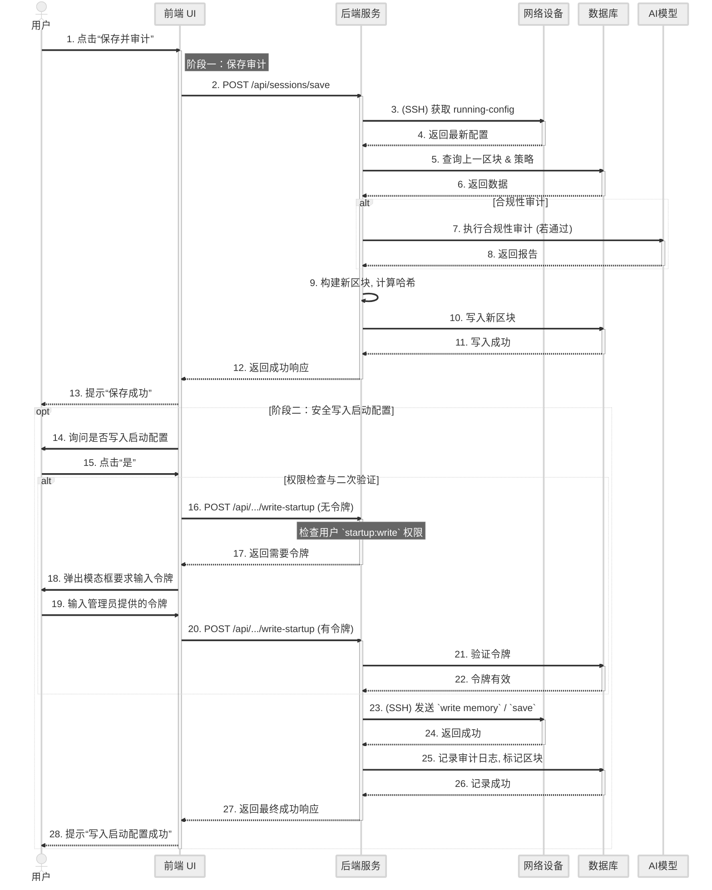

---

### **4. 图3-4 系统功能模块结构图**

[图表建议 - 类型: 生成图]
[图表标题: 图3-4 系统功能模块结构图]
[图表描述: 绘制一个层次化的功能模块图。顶层为“智能网络配置审计系统”。下一层分解为四大核心模块：“核心审计链模块”、“AI智能治理模块”、“实时交互终端模块”、“自动化与管理模块”。每个核心模块下再细分出2-3个关键子功能，例如“核心审计链模块”下包含“区块管理”和“链完整性验证”；“AI智能治理模块”下包含“事前审计引擎”和“AI辅助工作流”等。]

#### **生成代码 (Mermaid)**

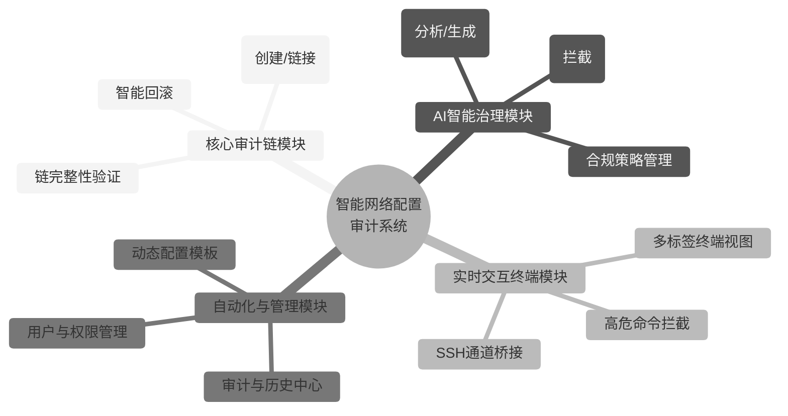

---

### **5. 图3-5 系统数据库实体-关系图 (E-R Diagram)**

[图表建议 - 类型: 生成图]
[图表标题: 图3-5 系统数据库实体-关系图 (E-R Diagram)]
[图表描述: 使用更清晰的流程图语法重新绘制E-R图，以明确展示各实体及其关键属性，并通过带基数（Cardinality）说明的连接线来详细阐述实体间的“一对多”和“多对多”关系。]

#### **生成代码 (Mermaid)**

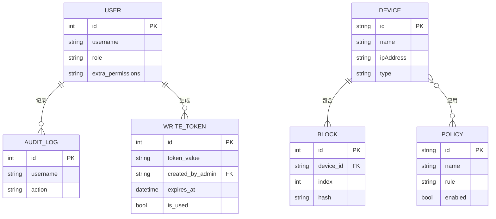
*注：`o--o`代表多对多，`||--|{`代表一对多。为简洁起见，图中省略了部分实体和所有非关键属性。*

---

### **6. 表3-1 至 表3-5 核心数据表结构**

[图表建议 - 类型: 生成图]
[图表标题: 表3-1 至 表3-5 核心数据表结构]
[图表描述: 分别为users, devices, blocks, policies, 和 device_policy_association 这五张核心数据表创建结构清晰的表格。每张表格应包含三列：“字段名”、“数据类型”和“描述/约束”。例如，在blocks表中，应列出id, device_id, index, timestamp, data, prev_hash, hash等字段，并注明其数据类型（如INTEGER, TEXT）和约束（如主键, 外键, 非空, 唯一）。]

#### **生成代码 (Markdown Table)**

**表3-1 `users` 表**
| 字段名 | 数据类型 | 描述/约束 |
| :--- | :--- | :--- |
| id | INTEGER | 主键，自增 |
| username | TEXT | 用户名，唯一，非空 |
| password | TEXT | 密码，非空 |
| role | TEXT | 角色 (admin/operator)，非空 |
| extra_permissions| TEXT | 额外权限（逗号分隔），可为空 |

**表3-2 `devices` 表**
| 字段名 | 数据类型 | 描述/约束 |
| :--- | :--- | :--- |
| id | TEXT | 主键，设备唯一ID |
| name | TEXT | 设备名称，非空 |
| ipAddress | TEXT | IP地址，非空 |
| type | TEXT | 设备类型，非空 |

**表3-3 `blocks` 表**
| 字段名 | 数据类型 | 描述/约束 |
| :--- | :--- | :--- |
| id | INTEGER | 主键，自增 |
| device_id | TEXT | 外键，关联 `devices.id` |
| index | INTEGER | 区块索引，非空 |
| timestamp | TEXT | 时间戳 (ISO 8601)，非空 |
| data | TEXT | 区块业务数据 (JSON字符串)，非空 |
| prev_hash | TEXT | 前一区块哈希，非空 |
| hash | TEXT | 当前区块哈希，唯一，非空 |

**表3-4 `policies` 表**
| 字段名 | 数据类型 | 描述/约束 |
| :--- | :--- | :--- |
| id | TEXT | 主键，策略唯一ID |
| name | TEXT | 策略名称，唯一，非空 |
| severity | TEXT | 严重性，非空 |
| description | TEXT | 描述，非空 |
| rule | TEXT | 规则 (自然语言)，非空 |
| enabled | BOOLEAN | 是否启用，非空，默认True |

**表3-5 `device_policy_association` 表**
| 字段名 | 数据类型 | 描述/约束 |
| :--- | :--- | :--- |
| device_id | TEXT | 复合主键，外键，关联 `devices.id` |
| policy_id | TEXT | 复合主键，外键，关联 `policies.id` |

---

### **7. 图3-6 五道“法证级”防线安全模型**

[图表建议 - 类型: 生成图] 
[图表标题: 图3-6 五道“法证级”防线安全模型] 
[图表描述: 绘制一张层次化的流程图，从上到下依次展示五道防线。每一层都应有清晰的标题和简短的功能描述。]

#### **生成代码 (Mermaid)**

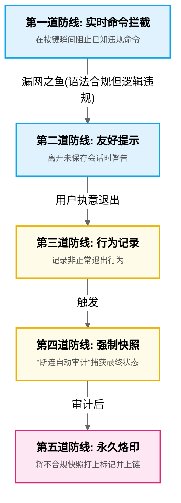

---

## **第四章 核心功能模块的实现**

### **1. 图4-1 可插拔AI驱动架构示意图**

[图表建议 - 类型: 生成图]
[图表标题: 图4-1 可插拔AI驱动架构示意图]
[图表描述: 绘制一张架构图。中心是“`services.py` (业务逻辑层)”，它有一个指向“`config.ini` (配置)”的读取箭头。`config.ini`中突出`driver = spark`的配置。根据这个配置，一个箭头从`services.py`指向一个名为“`ai_drivers`模块”的方框。该方框内并列包含三个子模块：“`gemini_driver`”、“`spark_driver`”和“`http_driver`”，其中`spark_driver`被高亮。这直观地展示了系统如何根据配置动态选择并加载AI驱动。]

#### **生成代码 (Mermaid)**

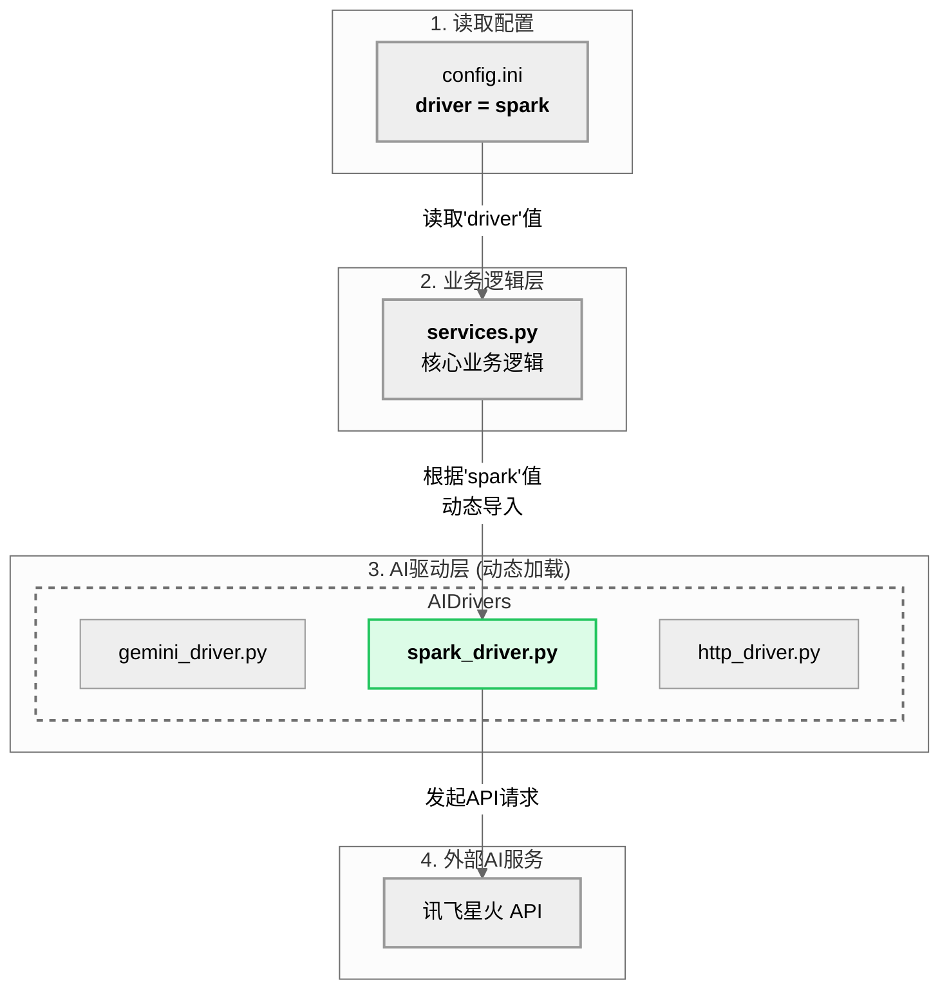

---

### **2. 图4-2 AI事前治理变更拦截工作流图**

[图表建议 - 类型: 生成图]
[图表标题: 图4-2 AI事前治理变更拦截工作流图]
[图表描述: 绘制一张流程图来详细解释后端`perform_add_block`函数中的治理逻辑。流程从“收到配置提交请求”开始，经过一个菱形判断框“是否为常规更新？”。如果是，则流程走向“执行AI合规审计”；如果否（如回滚、自动审计），则跳过。AI审计后再接一个判断框“审计是否通过？”。如果否，则流程走向“拒绝请求并返回错误”；如果是，则流程继续走向“执行AI智能分析”、“构建新区块”、“写入数据库”等后续步骤，最终“返回成功响应”。]

#### **生成代码 (Mermaid)**

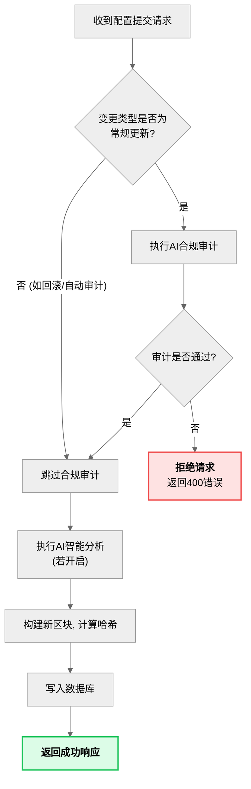

---

### **3. 图4-3 “安全写入启动配置”工作流**

[图表建议 - 类型: 生成图]
[图表标题: 图4-3 “安全写入启动配置”工作流]
[图表描述: 绘制一张流程图，详细描述用户从请求写入启动配置到最终完成的完整、安全的工作流。流程从“用户点击‘是’（同意写入）”开始，依次经过“检查`startup:write`权限”、“请求/输入一次性令牌”、“后端验证令牌”，如果全部通过，则由“后端根据设备类型发送保存命令”，最终“标记区块为已固化”并“返回成功”。在权限和令牌验证失败时，流程应走向“返回错误/提示”。]

#### **生成代码 (Mermaid)**

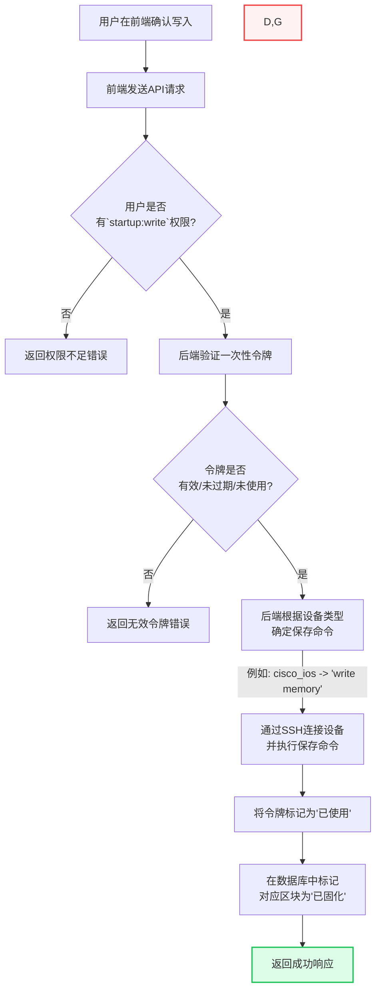

---

### **4. 图4-4 交互式终端高危命令拦截机制流程图**
*注：原图4-2在第四章的上下文中存在歧义，此处重新编号为4-4以保持章节内唯一性。*

[图表建议 - 类型: 生成图]
[图表标题: 图4-4 交互式终端高危命令拦截机制流程图]
[图表描述: 绘制一张流程图来解释后端`unified_io_handler`中的命令拦截逻辑。流程从“接收到用户按键”开始。经过一个判断框“是否为回车键？”。如果否，则“累加到行缓冲区并转发给设备”。如果是，则提取行缓冲区内容，并对其进行标准化处理，然后判断是否在黑名单中。如果否，则“正常发送换行符执行命令”。如果是，则走向“向设备发送CTRL+U清除信号”、“向前端发送违规警告”，最终都回到“清空行缓冲区”并等待下一次输入。]

#### **生成代码 (Mermaid)**

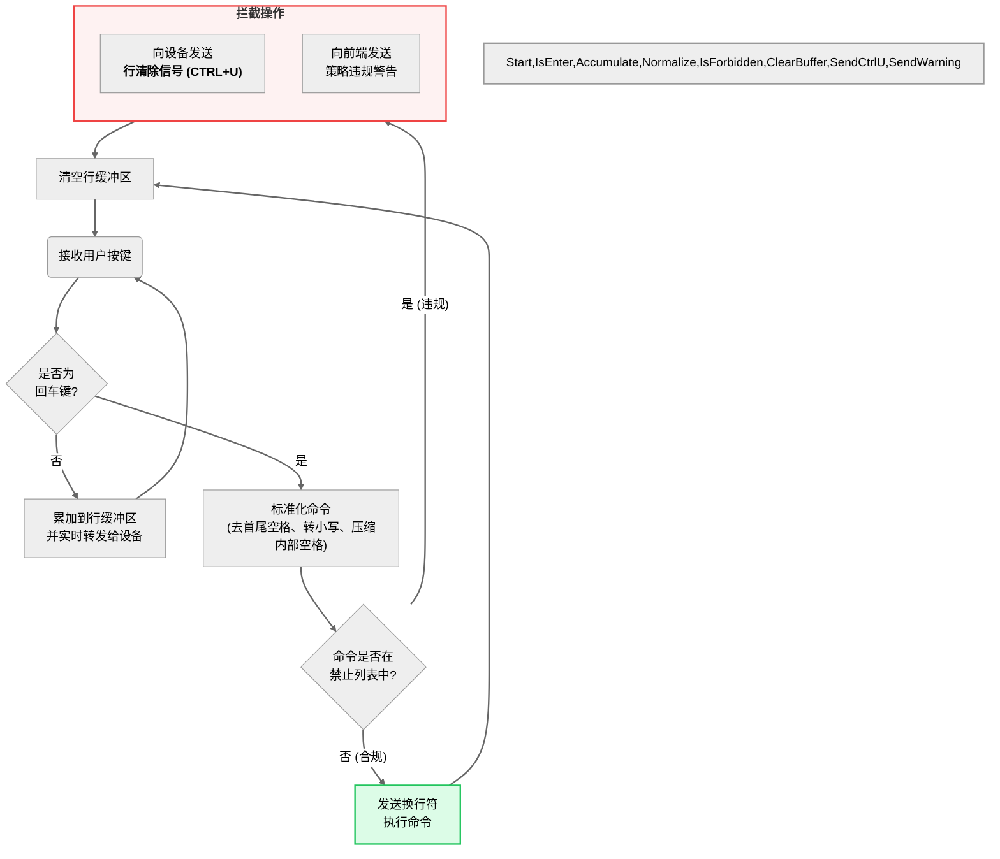

---

## **第六章 总结与展望**

### **1. 图6-1 未来网络拓扑可视化功能概念图**

[图表建议 - 类型: 生成图]
[图表标题: 图6-1 未来网络拓扑可视化功能概念图]
[图表描述: 绘制一张未来“网络拓扑”视图的用户界面（UI）概念设计图。图中包含代表不同类型网络设备（互联网、防火墙、路由器、交换机）的图标节点，节点之间通过连线表示物理连接。通过子图将网络划分为不同区域，并为不同设备类型定义了颜色。最重要的是，右侧增加了一个“交互功能示例”注释框，用以传达悬停、点击等交互概念。]

#### **生成代码 (Mermaid)**

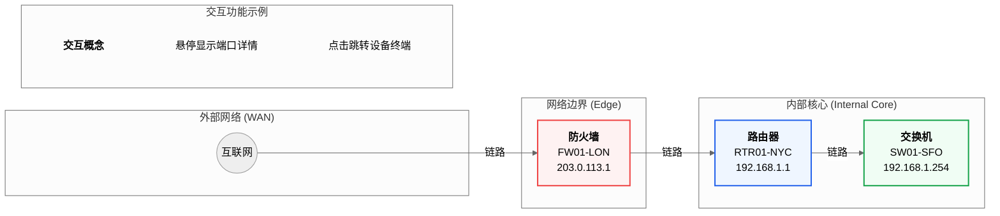